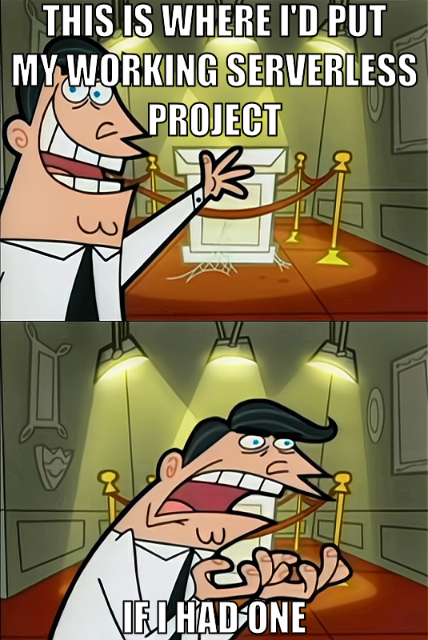

<!--
title: 'Serverless Framework Node Express API service backed by DynamoDB on AWS'
description: 'This template demonstrates how to develop and deploy a simple Node Express API service backed by DynamoDB running on AWS Lambda using the Serverless Framework.'
layout: Doc
framework: v4
platform: AWS
language: nodeJS
priority: 1
authorLink: 'https://github.com/serverless'
authorName: 'Serverless, Inc.'
authorAvatar: 'https://avatars1.githubusercontent.com/u/13742415?s=200&v=4'
-->

# Meme Generator

Serverless API to generate memes.


## Start project locally

Install dependencies with:

```
npm install
```

and then deploy with:

```
serverless offline start --reloadHandler
```

## API Endpoints

The service exposes the following endpoints:

### Upload Image Template

Upload an image to use as meme template.

- **URL**: `/upload`
- **Method**: `POST`
- **Content-Type**: `multipart/form-data`
- **Request Body**:
  - `file`: The image file to upload (required)
- **Response**:
  ```json
  {
    "success": true,
    "url": "string"
  }
  ```

### Generate Meme

Generate a meme using a previously uploaded image template.

- **URL**: `/generate`
- **Method**: `POST`
- **Content-Type**: `application/json`
- **Request Body**:
  - `imageUrl`: The URL of the uploaded image template (required)
  - `title`: The title of the meme (required)
  - `topText`: The text to display at the top of the meme (optional, required if `bottomText` is not provided)
  - `bottomText`: The text to display at the bottom of the meme (optional, required if `topText` is not provided)
- **Response**:
  ```json
  {
    "success": true,
    "url": "string"
  }
  ```

### List all Memes

Get a list of all generated memes, sorted by creation date (newest first).

- **URL**: `/memes`
- **Method**: `GET`
- **Response**:
  ```json
  {
    "success": true,
    "memes": [
      {
        "id": "string",
        "title": "string",
        "imageUrl": "string",
        "createdAt": "string"
      }
    ]
  }
  ```

### Get Meme by ID

Get details of a specific meme.

- **URL**: `/memes/:id`
- **Method**: `GET`
- **Response**:
  ```json
  {
    "success": true,
    "id": "string",
    "title": "string",
    "imageUrl": "string",
    "createdAt": "string"
  }
  ```

### Example


